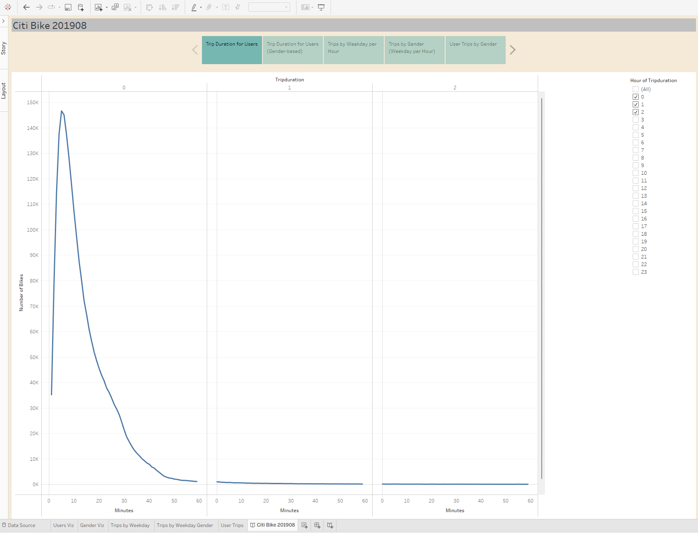
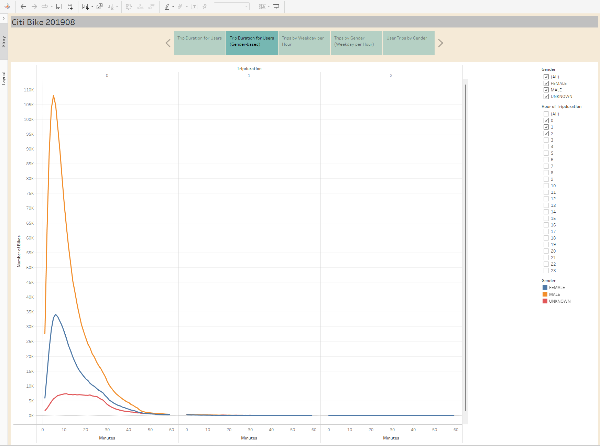
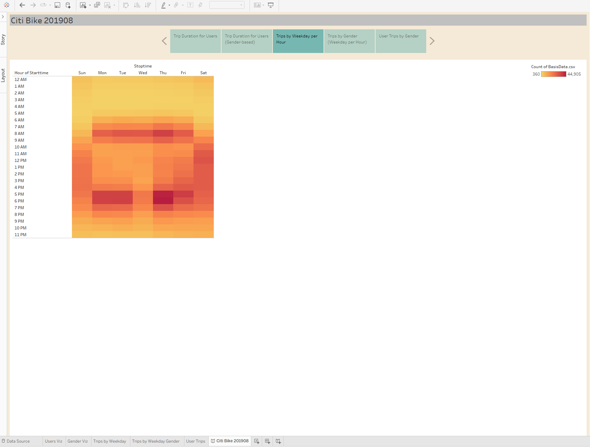

# 201908 Citi Bike Bikesharing Analysis
## Overview
The purpose of the analysis is to use Tableau to visualize bike-sharing data to support the Boise start-up efforts. Data from the Citi Bike bikesharing database were utilized in this analysis. Specifically, data from August of 2019. In order to assist the Boise start-up, the objective of the analysis was to:
+ Identify how long bikes are checked out for all riders and genders.
+ Identify how many trips are taken by the hour for each day of the week, for all riders and genders.
+ Provide a breakdown of what days of the week a user might be more likely to check out a bike, by type of user and gender.

## Results
### Trip Duration

### Trip Duration, Gender

### Trips by Weekday

### Trips by Weekday, Gender

### User Trips, Gender

## Summary

[Link to Tableau Public Story](https://public.tableau.com/app/profile/josh3547/viz/Module14_CitiBike_14/CitiBike201908?publish=yes)
