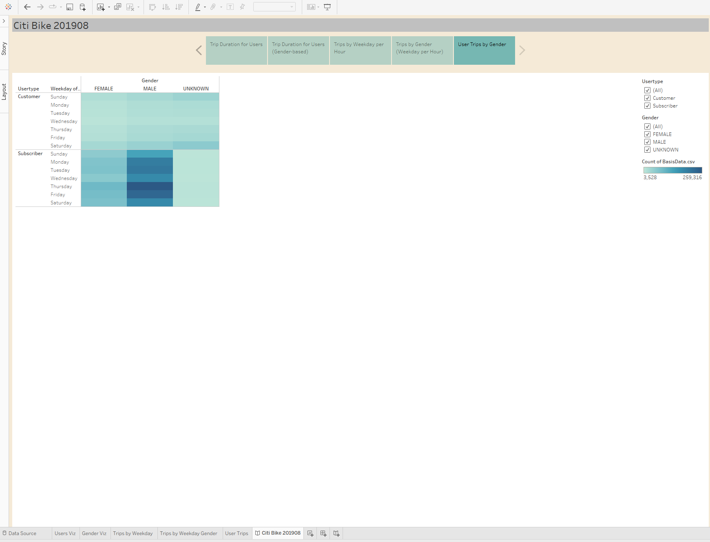

# 201908 Citi Bike Bikesharing Analysis
## Overview
The purpose of the analysis is to use Tableau to visualize bike-sharing data to support the Boise start-up efforts. Data from the New York City Citi Bike bikesharing database were utilized in this analysis. Specifically, data from August of 2019. In order to assist the Boise start-up, the objective of the analysis was to:
+ Identify how long bikes are checked out for all riders and genders.
+ Identify how many trips are taken by the hour for each day of the week, for all riders and genders.
+ Provide a breakdown of what days of the week a user might be more likely to check out a bike, by type of user and gender.

## Results
### Trip Duration
The image below shows the trip duration for all riders. The peak of the duration occurs between 5 and 6 minutes. The distribution of trip duration is skewed to the shorter trips. The Boise start-up should consider bike share locations that better allow for short duration trips. 

### Trip Duration, Gender
The image below shows the trip duration for riders by gender. The trip duration peak occurs between 5 and 10 minutes, regardless of gender. The image helps to illustrate the much higher number of bike shares by the male gender. Demographics of the region are not accounted for in the data, so this requires further investigation.

### Trips by Weekday
The image below shows the trips by weekday per hour. The heat map indicates the greatest ridership occus between 8am to 9am and 5pm to 6pm on weekdays. Additionally, ridership is strong on weekends, but is much more even during the 10am to 7pm compared to weekdays. Interestingly, Wednesday evening rush hour is a less popular bike share timeframe.

### Trips by Weekday, Gender
The image below shows similar patterns to that above for male and female gender. The unknown classified gender does not indicate much correlaton to the weekday per hour. As with the previous gender-based analysis, demographics of the region are not accounted for in the data, so this requires further investigation.

### User Trips, Gender
The image below illustrates that the greatest usertype is male subscirbers for all days of the week. The female subscribers follow a similar pattern, but to less magnitude. As with the previous gender-based analyses, demographics of the region are not accounted for in the data, so this requires further investigation.

## Summary
The analysis provides some insights to the New York City CitiBank bike share program and ridership as a function of duration, weekday per hour and user type. The Boise start-up team should consider the demographics associated with the NYC ridership before implementing gender-based ride marketing and deployment. However, the trip duration results, trips by weekday per hour and user type provide the Boise start-up team with a path forward for implementing locations to allow for 5 to 10 minute durations, weekday commuting, weekend daytime rides and an emphasis on gaining subscribers. 

The analyses presented were completed using the Tableau Public platform and can be found here:
[Link to Tableau Public Story](https://public.tableau.com/app/profile/josh3547/viz/Module14_CitiBike_14/CitiBike201908?publish=yes)
